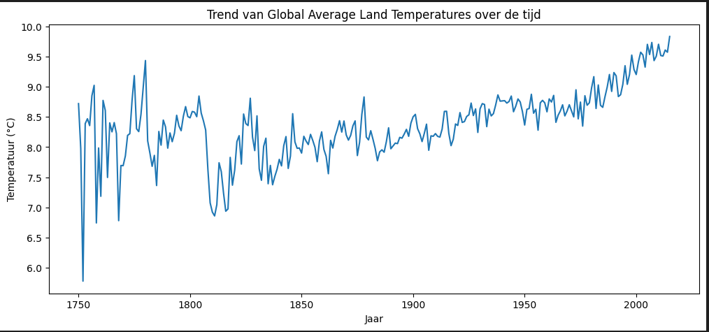

Je ziet dat de temperatuur tot 1975 redelijk stabiel is maar vanaf toen flink is gaan stijgen

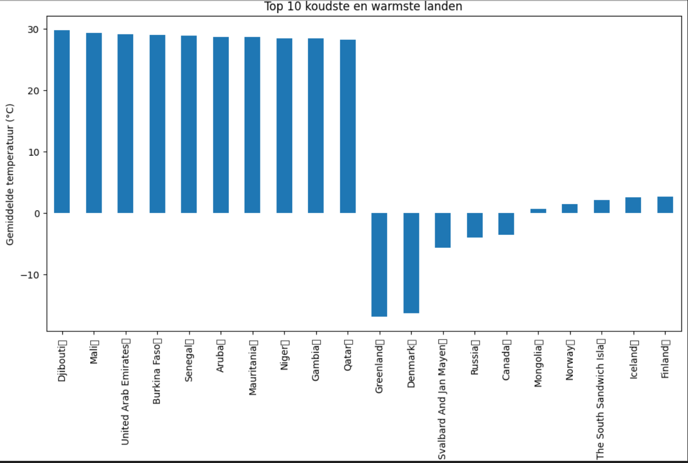

er zijn maar 5 landen waar de gemiddelde temperatuur onder de 0 is met Groendland en Denemarken als echte uitschieters naar onder (waarschijnlijk telt Groenland toch ook mee in temperatuur in Denemarken anders is die temperatuur niet te verklaren). 7 van de 10 warmste landen komen uit Afrika. 9 van de 10 koudste landen ligt op het noordelijke halfgrond

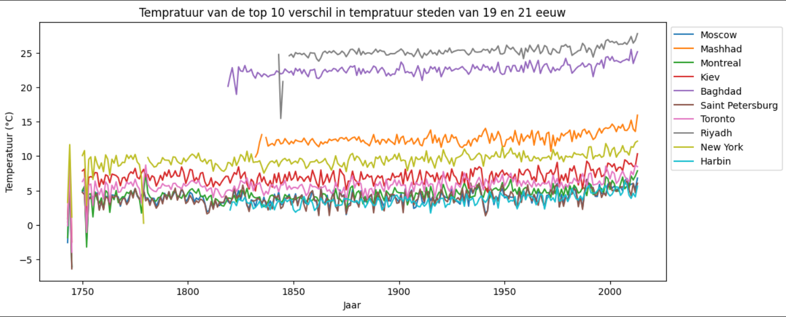 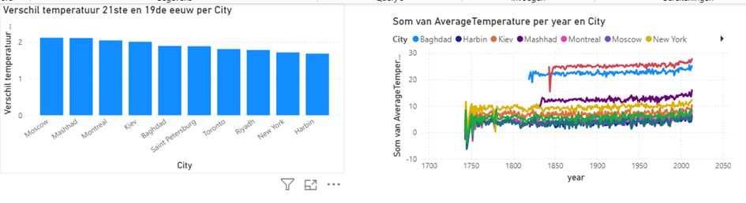
in deze grafiek zie je de 10 major city"s die het grootste verschil in temperatuur hebben tussen de 19de en 21ste eeuw. Ze zijn allemaal warmer 1,8 tot 2,1 graden warmer geworden in de 21ste eeuw ten opzichte van de 19de eeuw.

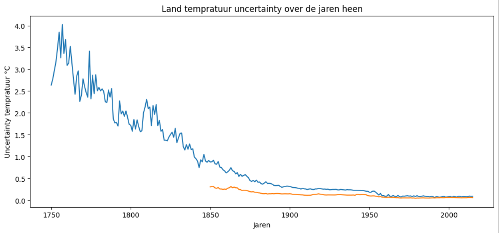
in deze grafiek zie de meetonzekerheid je ziet dat de meetapperatuur steeds nauwkeuriger wordt waardoor de onzekerheid daalt. Ook valt op dat de  ocean temperatuur nauwkeuriger te meten is dan land.

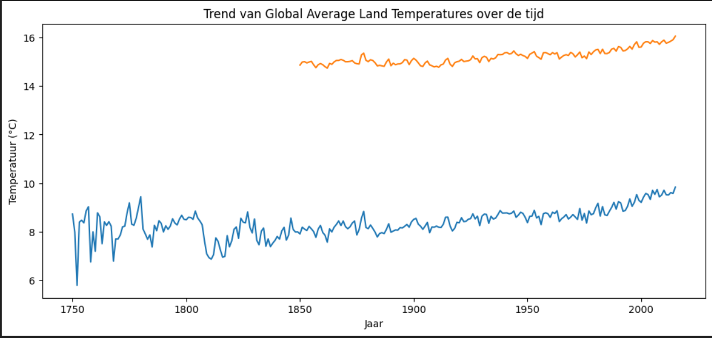
In deze grafiek zie je de temperatuur van land en landandocean temperatuur over de tijd je ziet dat de temperatuur de laatste jaren stijgt en dat landandocean temperatuur hoger liggen dan land temperatuur. dit komt omdat water warmte beter vasthoud.

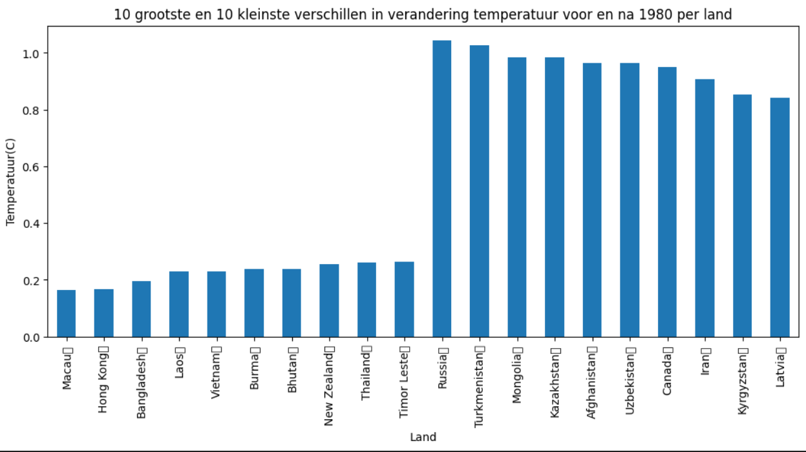
in deze grafiek is de cooling bias van de elektronische thermostaten die vanaf 1980 ingebruik zijn genomen niet te zien dit kan komen omdat de stijging van klimaat verandering groter is dan de cooling bias.

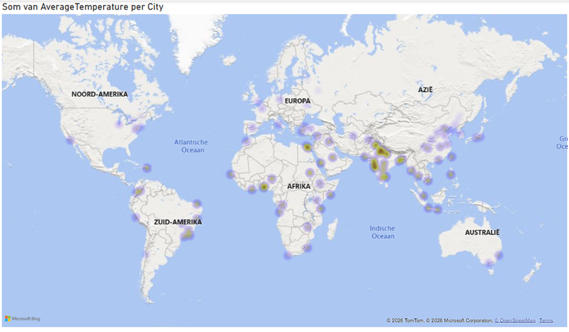
op de wereld kaart is te zien dat het rond de evenaar het warmst is en ook in india.

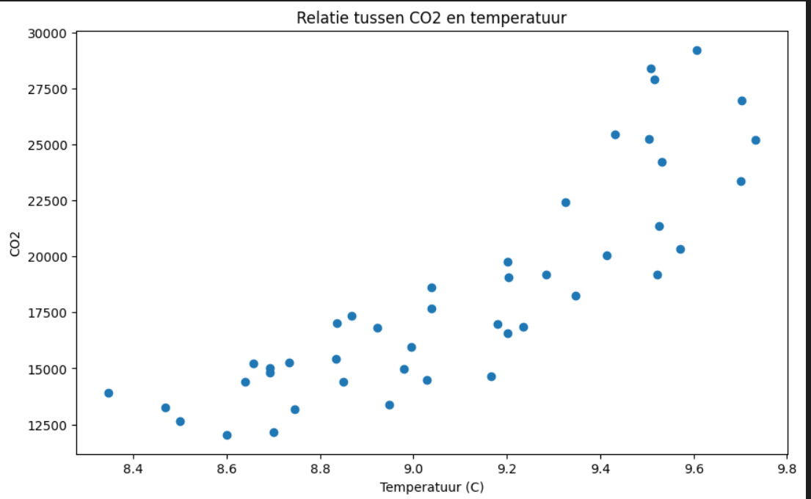
Tussen Temperatuur en CO2 uitstoot is een positieve correlatie gevonden van 0.85 (sterke correlatie). Dit betekend hoe meer CO2 uitgestoten wordt hoe meer de aarde opwarmt

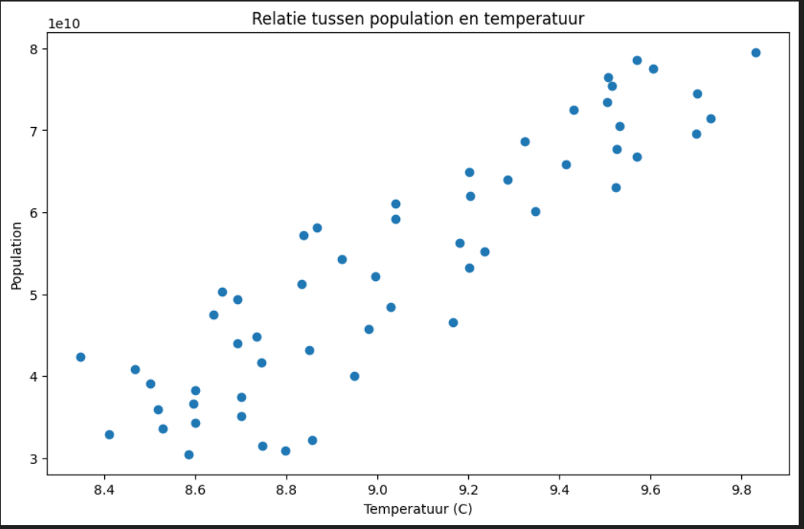
Tussen temperatuur en populatie is een positieve correlatie gevonden van 0.89 (sterke correlatie). Dit beteknd hoe groter de wereld populatie de warmer het wordt. Dit kan komen omdat er voor meer mensen meer voedsel nodig is dus meer akkers komen en er meer ontbossing is. Ook worden er meer producten gemaakt wat de CO2 uitstoor verhoogd.

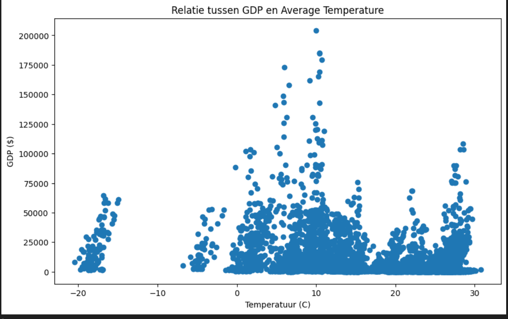
Tussen temperatuur en GDP is een negatieve correlatie gevonden van -0.34 (zwakke correlatie). 

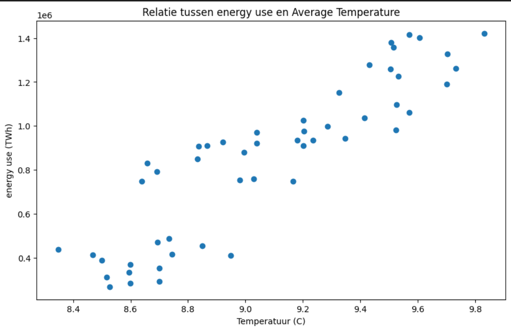
Tussen temperatuur en energie verbruik is een positieve correlatie van 0.89 (sterke correlatie). dit kan komen omdat bij veel van de opgewekte energie CO2 vrij komt.

site co2 uitstoot: https://edgar.jrc.ec.europa.eu/report_2025#data_download
site population data: https://data.worldbank.org/indicator/SP.POP.TOTL
site bbp data: https://data.worldbank.org/indicator/NY.GDP.PCAP.CD
site energie verbruik https://ourworldindata.org/grapher/primary-energy-cons?mapSelect=~OWID_HIC&overlay=download-data#explore-the-data